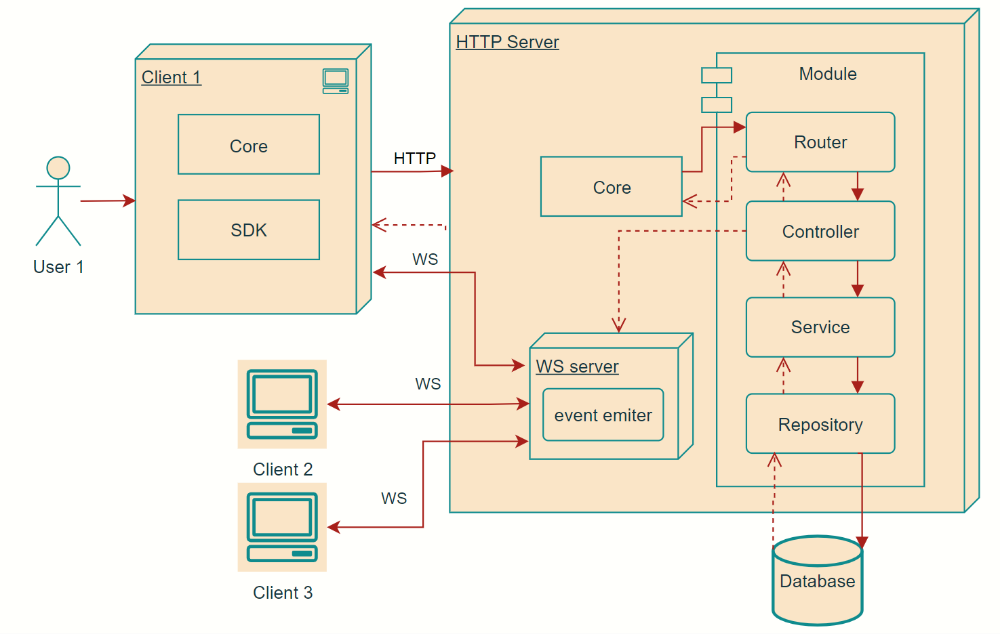
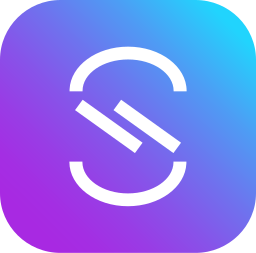

# 🚀 Cozy Chat - your ultimate chat application 🚀

Welcome to Cozy Chat, a powerful chat application built with C and SQLite.

## 🛠️ Technologies Used 🛠️

-   **C**: The core language used to build this application.
-   **SQLite**: Used for storing and managing data.
-   **JWT**: Used for authentication.

## 📚 Libraries Used 📚

-   **cJSON**: For handling JSON data.
-   **libmx**: A custom utility library.
-   **mongoose**: For handling HTTP requests and WS connections.
-   **sqlite3**: For interacting with SQLite databases.
-   **CURL**: For sending HTTP requests to server

## 📁 Project Structure 📁

-   **client**: Contains the client-side code.
-   **server**: Contains the server-side code.
-   **db**: Contains the SQLite database and related files(like migrations and seeds).
-   **lib**: Contains static libraries used in the project.

## 🚀 Getting Started 🚀

To get started with Cozy Chat, clone the repository and follow the instructions in the Makefile.

First of all you have to compile all static libs and repository code

`make`

After that [install gtk+3](https://letmegooglethat.com/?q=how+to+install+gtk3) if you dont have it.

Than you need to start server.
There is 2 ways to do it:

1. Easy(checks if any changes was made in server folder(recompiles if necessary) and than launch)

    `make server`

2. Edvanced(you can pass options to configure server)

    `./uchat_server 3000`

When server have started you can launch client.
There is 2 ways to do it:

1. Easy(checks if any changes was made in client and than launch)

    `make client`

2. Edvanced

    `./uchat localhost 3000`

## 🗄️ Database 🗄️

💡 Migrations, Triggers, and Database Flow 💡

Project uses migration to save db state amoung developers, triggers to change updated_at data, foreign keys to ensure security of provided data

Here is the schema of the Cozy Chat database:

## 🌐 API 🌐

Api is written on C using mongoose embeded framework.
It provides RESTfull architecture and uses MVC architeture design.
Cozy Chat provides comprehensive API documentation using OpenAPI and AsyncAPI specifications.

### OpenAPI Documentation 

The OpenAPI documentation describes the RESTful API endpoints and their corresponding request and response structures.

You can find doc at `server/docs/open-api.yaml`
How to open it? Google it if you are really interested 😉

(We used `OpenAPI (Swagger) Editor` VS code extenstion preview option)

[Link to docs](https://uchat-api-docs.vercel.app/)

###  AsyncAPI Documentation 

The AsyncAPI documentation provides information about websocket comunication

You can find doc at `server/docs/async-api.yaml`
How to open it? It is harder than open-api(couse it is not such popular).

You can use `asyncapi-preview` VS code extenstion preview option

### Happy chatting! 😄
